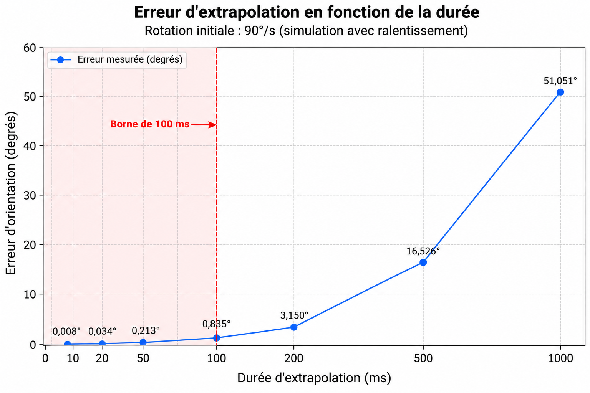

# Exercice 12 — La borne de cent millisecondes

Dans cet exercice, j'ai étudié l'erreur produite lorsqu'on extrapole une
rotation de tête en supposant que sa vitesse reste constante.

J'ai utilisé une vitesse initiale de **90 degrés par seconde** et j'ai comparé
deux valeurs :

- l'orientation prédite par extrapolation à vitesse constante ;
- l'orientation obtenue avec une simulation dans laquelle la tête ralentit
  progressivement.

L'objectif est de mesurer comment l'erreur évolue avec la durée
d'extrapolation et de voir où la borne de **100 ms** peut se justifier.

## Code C++

```cpp
#include <iostream>
#include <iomanip>
#include <cmath>

const double PI = 3.14159265358979323846;

double degVersRad(double deg)
{
    return deg * PI / 180.0;
}

double radVersDeg(double rad)
{
    return rad * 180.0 / PI;
}

// Prédiction à vitesse constante
double extrapoler(double vitesseInitiale, double dt)
{
    return vitesseInitiale * dt;
}

// Simulation de la vraie pose par petits pas
double vraiePose(double vitesseInitiale, double duree)
{
    const double pas = 0.001; // 1 ms

    double temps = 0.0;
    double angle = 0.0;
    double vitesse = vitesseInitiale;

    while (temps < duree)
    {
        double h = pas;

        if (temps + h > duree)
            h = duree - temps;

        /*
           Simulation d'un mouvement qui ralentit.
           La vitesse diminue progressivement avec le temps.
        */
        double facteur = std::exp(-2.0 * temps);
        vitesse = vitesseInitiale * facteur;

        angle += vitesse * h;
        temps += h;
    }

    return angle;
}

int main()
{
    // J'utilise ici une vitesse initiale de 90 degrés par seconde.
    double vitesseInitiale = degVersRad(90.0);

    double durees[] = {
        0.010,
        0.020,
        0.050,
        0.100,
        0.200,
        0.500,
        1.000
    };

    std::cout << std::fixed << std::setprecision(3);

    std::cout
        << "Duree(ms)  Extrapole(deg)  Reel(deg)  Erreur(deg)\n";

    for (double dt : durees)
    {
        double prediction =
            extrapoler(vitesseInitiale, dt);

        double reel =
            vraiePose(vitesseInitiale, dt);

        double erreur =
            std::fabs(prediction - reel);

        std::cout
            << dt * 1000.0 << "        "
            << radVersDeg(prediction) << "          "
            << radVersDeg(reel) << "       "
            << radVersDeg(erreur) << '\n';
    }

    return 0;
}
```

## Pourquoi j'ai utilisé 90°/s

L'énoncé proposait une vitesse initiale de **180°/s**.

Dans mon programme, j'ai choisi de faire le test avec **90°/s**, c'est-à-dire
une vitesse initiale deux fois plus faible, afin d'observer l'évolution de
l'erreur sur un mouvement de rotation moins rapide.

Ce choix ne change pas le principe de l'expérience : dans les deux cas, il
s'agit de comparer une prédiction qui suppose une vitesse constante à un
mouvement simulé qui ralentit progressivement.

Il change cependant les valeurs numériques obtenues. Les résultats présentés
dans cet exercice correspondent donc à mon test effectué à **90°/s**.

## Exécution du programme

J'ai exécuté le programme pour les durées suivantes :

- 10 ms ;
- 20 ms ;
- 50 ms ;
- 100 ms ;
- 200 ms ;
- 500 ms ;
- 1000 ms.

Le programme m'a fourni les résultats suivants :

| Durée | Angle extrapolé | Angle réel simulé | Erreur |
|---:|---:|---:|---:|
| 10 ms | 0,900° | 0,892° | **0,008°** |
| 20 ms | 1,800° | 1,766° | **0,034°** |
| 50 ms | 4,500° | 4,287° | **0,213°** |
| 100 ms | 9,000° | 8,165° | **0,835°** |
| 200 ms | 18,000° | 14,850° | **3,150°** |
| 500 ms | 45,000° | 28,474° | **16,526°** |
| 1000 ms | 90,000° | 38,949° | **51,051°** |

Ces résultats permettent de voir directement comment l'erreur augmente lorsque
la durée d'extrapolation devient plus importante.

## Courbe de l'erreur

À partir des valeurs obtenues lors de l'exécution du programme, j'ai tracé
la courbe de l'erreur d'orientation en fonction de la durée d'extrapolation.



Sur cette courbe :

- l'axe horizontal représente la **durée d'extrapolation en millisecondes** ;
- l'axe vertical représente l'**erreur d'orientation en degrés** ;
- les points correspondent aux erreurs réellement obtenues avec le programme ;
- la ligne verticale à **100 ms** permet de repérer la borne étudiée dans
  l'exercice.

Les points utilisés pour construire la courbe sont :

| Durée d'extrapolation | Erreur d'orientation |
|---:|---:|
| 10 ms | 0,008° |
| 20 ms | 0,034° |
| 50 ms | 0,213° |
| 100 ms | 0,835° |
| 200 ms | 3,150° |
| 500 ms | 16,526° |
| 1000 ms | 51,051° |

## Lecture de la courbe

La courbe montre d'abord une erreur très faible pour les extrapolations
courtes.

À **10 ms**, j'obtiens seulement :

`0,008°`

À **20 ms**, l'erreur est de :

`0,034°`

À **50 ms**, elle atteint :

`0,213°`

À **100 ms**, l'erreur mesurée est :

`0,835°`

Elle reste donc encore inférieure à un degré dans cette simulation.

Au-delà de cette zone, l'augmentation devient beaucoup plus importante.

À **200 ms**, l'erreur atteint :

`3,150°`

À **500 ms**, elle atteint :

`16,526°`

Et à **1000 ms**, elle atteint :

`51,051°`

La courbe montre donc clairement que prolonger l'extrapolation augmente
fortement le risque que la pose prédite s'éloigne de la pose réelle simulée.

## Où la borne de 100 ms se justifie-t-elle ?

Les valeurs numériques permettent de mieux comprendre la borne de 100 ms.

Autour de cette borne, j'obtiens :

```text
50 ms   -> 0,213°
100 ms  -> 0,835°
200 ms  -> 3,150°
```

Entre **50 ms et 100 ms**, l'erreur augmente de :

`0,835° - 0,213° = 0,622°`

Entre **100 ms et 200 ms**, elle augmente de :

`3,150° - 0,835° = 2,315°`

L'augmentation devient donc beaucoup plus importante après la zone des
100 ms.

À 100 ms, mon erreur reste inférieure à un degré avec **0,835°**.

En doublant la durée pour atteindre 200 ms, elle passe déjà à **3,150°**.

La courbe ne montre cependant pas une cassure brutale exactement à 100 ms.

Dans cette expérience, 100 ms n'est donc pas un seuil mathématique précis
où l'extrapolation deviendrait soudainement incorrecte.

Je l'interprète plutôt comme une **borne prudente** placée avant la zone où
l'erreur augmente rapidement.

## Pourquoi 100 ms plutôt que 50 ms ou 200 ms ?

Les résultats donnent une réponse numérique à cette question.

À **50 ms**, l'erreur n'est que de :

`0,213°`

Cette durée se trouve encore dans une zone où la différence entre le mouvement
prédit et le mouvement simulé reste très faible.

À **100 ms**, l'erreur atteint :

`0,835°`

Elle reste inférieure à un degré, mais la courbe commence à s'élever.

À **200 ms**, elle atteint déjà :

`3,150°`

La différence devient donc beaucoup plus importante.

Dans mon expérience, choisir une borne à 100 ms permet ainsi de rester avant
la forte augmentation observée entre 100 et 200 ms.

Cette valeur constitue donc une limite de sécurité raisonnable pour éviter
d'extrapoler trop loin.

## Pourquoi l'erreur augmente

L'extrapolation utilisée dans le programme suppose que la vitesse actuelle
reste constante :

`vitesse future = vitesse actuelle`

Cette hypothèse peut être raisonnable sur une courte durée.

Mais dans ma simulation, la vitesse réelle diminue progressivement selon le
facteur :

`exp(-2t)`

La prédiction continue donc à avancer comme si la tête tournait toujours à
90°/s, alors que la simulation ralentit progressivement.

Plus la durée augmente, plus la différence entre les deux mouvements devient
grande.

Par exemple, après une seconde, l'extrapolation prévoit :

`90,000°`

alors que le mouvement ralenti simulé donne :

`38,949°`

L'écart atteint donc :

`51,051°`

Cela montre pourquoi une extrapolation à vitesse constante ne doit pas être
prolongée trop loin dans le futur.

## Interprétation pour la VR

Dans un système VR, l'extrapolation permet d'estimer la position ou
l'orientation future de la tête afin de compenser une partie de la latence.

Sur une durée très courte, le mouvement n'a pas beaucoup de temps pour changer.
La vitesse actuelle peut donc fournir une approximation utile de la pose
future.

Mais plus la prédiction porte loin dans le futur, plus l'utilisateur a le
temps de ralentir, d'accélérer ou de changer de direction.

L'hypothèse de vitesse constante devient alors progressivement moins fiable.

Une extrapolation trop longue pourrait donc produire une pose prédite plus
éloignée de la vraie pose que celle obtenue avec une prédiction plus courte.

La borne sert ainsi à empêcher le système de continuer à extrapoler lorsque
la prédiction devient trop incertaine.

## Limite de mon expérience

La valeur de 100 ms ne constitue pas un seuil universel démontré par cette
seule simulation.

Mon expérience utilise :

- une vitesse initiale de 90°/s ;
- un mouvement qui ralentit selon `exp(-2t)` ;
- une simulation numérique avec un pas de 1 ms.

Avec un autre mouvement, par exemple une accélération ou un changement brutal
de direction, la forme de la courbe pourrait être différente.

Ce que mon expérience montre surtout, c'est que l'erreur augmente avec
l'horizon de prédiction et qu'il devient nécessaire de borner
l'extrapolation.

## Conclusion

L'exécution du programme m'a permis de mesurer directement l'erreur
d'extrapolation pour plusieurs durées.

Pour mon test à **90°/s**, j'ai obtenu :

```text
10 ms    -> 0,008°
20 ms    -> 0,034°
50 ms    -> 0,213°
100 ms   -> 0,835°
200 ms   -> 3,150°
500 ms   -> 16,526°
1000 ms  -> 51,051°
```

La courbe obtenue ne présente pas une cassure brutale exactement à 100 ms.

Elle montre une augmentation progressive de l'erreur, qui devient beaucoup
plus importante au-delà de cette zone.

À **100 ms**, l'erreur est encore de **0,835°**, alors qu'elle atteint déjà
**3,150° à 200 ms**, puis **16,526° à 500 ms**.

Dans cette simulation, la borne de **100 ms** apparaît donc comme une limite
prudente placée avant une augmentation importante de l'erreur.

Cette expérience permet ainsi de justifier la borne à partir de **valeurs
mesurées et d'une courbe**, et non seulement à partir d'une appréciation
qualitative de l'extrapolation.
