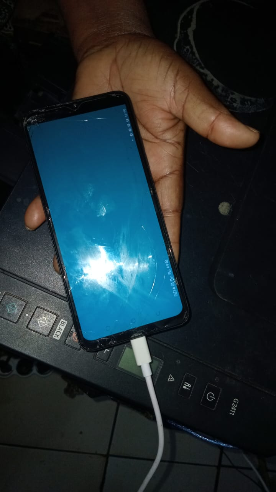

# Chapitre 02 — Démo 5 : du bureau à la main

Démonstration faite en direct : je tape les commandes sur mon ordinateur, et **ma sœur Hugette** tient le téléphone pendant l'installation. Le téléphone est un TECNO SPARK 10C (série `105453739L108475`, Android 12, `arm64-v8a`), relié à l'ordinateur par le câble USB. Le programme est `MaSalle` : il remplit l'écran de bleu-vert et écrit trois lignes dans le journal.

Environnement : Windows x86_64, Jenga 2.8.0, NDK 26.3.11579264, build-tools 34.0.0, depuis `C:\Users\HP\Documents\GitHub\ani-4087\chapitre-02\demo5-du_bureau_a_la_main`.

## Étape 0 — Vérifier l'appareil

```text
C:\Android\platform-tools\adb.exe devices
* daemon not running; starting now at tcp:5037
* daemon started successfully
List of devices attached
105453739L108475        device
```

**Ce que j'explique à la classe :** avant toute chose, on vérifie que l'ordinateur voit l'appareil, et qu'il est à l'état `device`, c'est-à-dire branché **et** autorisé. Si la ligne disait `unauthorized`, il faudrait accepter la fenêtre sur le téléphone ; si elle était absente, le câble, le port ou le débogage USB seraient en cause. On ne commence pas une démonstration sans cette ligne.

## Étape 1 — Construire

```text
jenga clean --platform android-arm64 --config Release
jenga build --platform android-arm64 --config Release
```

```text
Configuration: Release
Target:        Android arm64
Toolchain:     android-ndk

Build Order (1 projects):
  1. MaSalle [WINDOWED_APP]

ℹ Found 1 source file(s)
✓   [1/1] Compiled: main.cpp
ℹ Linking...
✓ Built: build\bin\Android\Release\libMaSalle.so
✓ Build Successful                                Time: 2.74s

ℹ Building APK for MaSalle (arm64-v8a)
⚠ Debug keystore not found at C:\Users\HP\.android\debug.keystore - APK ne sera PAS signe ; Android refusera l'install.
✓ APK generated: ...\build\bin\Android\Release\android-build-arm64-v8a\MaSalle-Release.apk
```

**Ce que j'explique :** je commence par `clean`, parce que Jenga ne recompile que si un **fichier source** a changé : il ne voit pas un changement de réglage, et il m'a déjà fait installer une ancienne version sans le dire. Je précise `--platform android-arm64`, sinon Jenga construit pour l'architecture de mon ordinateur, `x86_64`, que le téléphone refuse. La ligne `Toolchain: android-ndk` confirme que c'est bien le compilateur du NDK qui travaille, et non celui de Windows. Le résultat est `libMaSalle.so`, mon programme sous forme de bibliothèque native, puisqu'une application Android native n'a pas de `.exe`.

L'avertissement sur la clé de debug est attendu : Jenga signerait volontiers avec une clé de test, mais je n'en ai pas. Je signerai moi-même, à l'étape 3, avec ma propre clé.

## Étape 2 — Empaqueter

```text
tar -tvf build\bin\Android\Release\android-build-arm64-v8a\MaSalle-Release.apk
-rw-rw-r--  0 0      0        2196 janv. 01  1980 AndroidManifest.xml
-rw-rw-r--  0 0      0          40 janv. 01  1980 resources.arsc
-rw-rw-r--  0 0      0       23440 sept. 23 08:34 lib/arm64-v8a/libMaSalle.so
```

```text
mkdir dist
copy build\bin\Android\Release\android-build-arm64-v8a\MaSalle-Release.apk dist\MaSalle-non-signe.apk
        1 fichier(s) copié(s).
```

**Ce que j'explique :** un APK est une archive zip ordinaire, donc `tar` sait l'ouvrir, et on peut regarder dedans avant de l'installer. Il contient trois choses : le manifeste, qui est la carte d'identité de l'application (son identifiant `com.mafo.masalle`, la version d'Android minimale, l'activité à lancer), une table de ressources presque vide, et surtout **mon programme**, dans `lib/arm64-v8a/`. C'est ce chemin qu'il faut regarder : s'il disait `lib/x86_64/`, l'installation serait refusée. Je copie ensuite le paquet dans `dist` sous le nom `MaSalle-non-signe.apk`, pour garder la version non signée à côté de la version signée.

## Étape 3 — Signer

```text
"C:\Android\build-tools\34.0.0\apksigner.bat" sign --ks "%USERPROFILE%\cles\masalle.jks" --ks-key-alias masalle --out dist\MaSalle.apk dist\MaSalle-non-signe.apk
Keystore password for signer #1:
```

Le premier essai a échoué, parce que j'ai mal tapé le mot de passe :

```text
Failed to load signer "signer #1"
java.io.IOException: keystore password was incorrect
```

Au second essai, la commande rend la main sans rien afficher : c'est signé. Vérification :

```text
"C:\Android\build-tools\34.0.0\apksigner.bat" verify --print-certs dist\MaSalle.apk
Signer #1 certificate DN: CN=Mafo, O=ENSPY, L=Yaounde, C=CM
Signer #1 certificate SHA-256 digest: 9a6437dd7513fb10c89b9468f5f6f874b4b938a0894d4a36f8907ba730da07bb
Signer #1 certificate SHA-1 digest: a2026952a1060229b347ecd538052f7ccaa82d0a
Signer #1 certificate MD5 digest: 91d8bbb0ec999dd476a16cbabf8191b5
```

**Ce que j'explique :** Android refuse d'installer un paquet non signé. La signature n'empêche personne de lire l'application ; elle prouve **qui l'a produite**, et elle garantit que les mises à jour viennent de la même personne. Le mot de passe ne figure nulle part dans la commande : `apksigner` le demande au clavier, sans l'afficher, ce qui évite de le laisser dans l'historique du terminal ou dans un fichier du dépôt. Il est noté dans mon carnet, hors du dépôt. Et je le dis franchement à la classe : je me trompe souvent en le tapant, comme ici au premier essai. La vérification affiche le certificat : `CN=Mafo, O=ENSPY, L=Yaounde, C=CM`, c'est bien ma clé.

## Étape 4 — Installer, le téléphone dans la main de quelqu'un d'autre

C'est ici que **Hugette** prend le téléphone. Elle ne touche à rien, elle le tient simplement, écran visible pour la classe. Moi, je reste au clavier.

```text
C:\Android\platform-tools\adb.exe install -r dist\MaSalle.apk
Performing Incremental Install
Performing Streamed Install
Success
```

```text
C:\Android\platform-tools\adb.exe logcat -c
C:\Android\platform-tools\adb.exe shell am force-stop com.mafo.masalle
C:\Android\platform-tools\adb.exe shell monkey -p com.mafo.masalle -c android.intent.category.LAUNCHER 1
```



**Ce que j'explique :** `install -r` remplace la version déjà présente sans effacer l'application. `Success` vient d'`adb`, pas de moi. Ensuite, je vide le journal, j'arrête l'application si elle tournait encore, et je la lance à distance. L'écran s'allume et devient bleu-vert **dans la main de Hugette**, qui n'a rien touché : ma commande, tapée sur l'ordinateur, s'exécute sur un appareil tenu par quelqu'un d'autre, au bout d'un câble. C'est exactement ce que fait un développeur toute la journée, et c'est ce qui se passera au chapitre suivant avec le casque.

## Étape 5 — La preuve dans le journal

```text
C:\Android\platform-tools\adb.exe logcat -d -s MaSalle
--------- beginning of main
09-23 08:49:38.133 29146 29165 I MaSalle : 1/3 Bienvenue dans MaSalle ! Demarrage de l'application native.
09-23 08:49:38.197 29146 29165 I MaSalle : 2/3 Fenetre prete : 1540 x 720 pixels
09-23 08:49:38.225 29146 29165 I MaSalle : 3/3 Ecran rempli en bleu-vert : 1540 x 720 pixels
```

**Ce que j'explique :** la photo montre le résultat, le journal montre le déroulement. Les trois lignes viennent de mon programme, filtrées par leur étiquette `MaSalle` au milieu des milliers de lignes du système. En 92 millisecondes, le programme démarre, reçoit sa fenêtre de 1540 × 720 pixels, et la remplit. On voit aussi que la fenêtre est plus large que haute : l'application s'ouvre en paysage, comme le demande mon fichier de projet.

## Ce que la démonstration montre

| Étape | Commande | Ce qu'on vérifie |
|---|---|---|
| 0 | `adb devices` | l'appareil est vu et autorisé |
| 1 | `jenga clean` + `jenga build --platform android-arm64` | la bibliothèque `arm64` est produite |
| 2 | `tar -tvf` | le paquet contient `lib/arm64-v8a/libMaSalle.so` |
| 3 | `apksigner sign`, puis `verify --print-certs` | le paquet est signé par ma clé |
| 4 | `adb install -r`, puis `monkey` | `Success`, et l'écran devient bleu-vert dans la main de Hugette |
| 5 | `adb logcat -d -s MaSalle` | les trois lignes du programme |

Quatre étapes, quatre outils différents, et à chacune une vérification avant de passer à la suivante. C'est ce qui permet, quand quelque chose casse, de savoir tout de suite **où** cela a cassé, au lieu de chercher dans tout le chemin.

Un mot pour finir : cette suite de commandes est exactement celle que mon script de l'exercice 23 automatise. Ici, je la déroule à la main pour la commenter ; au quotidien, une seule commande suffit.
