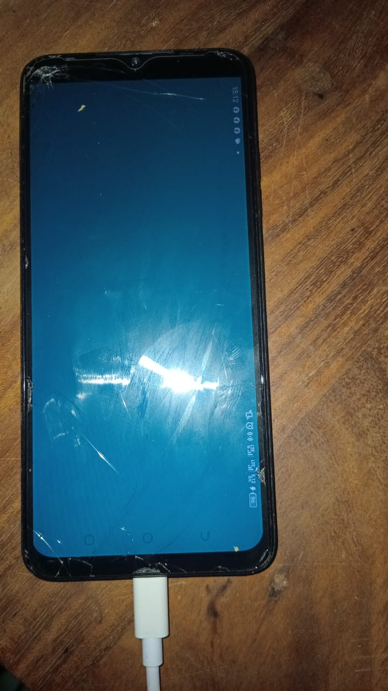

# Chapitre 02 — Exo 17 : l'installation

## La photographie



Mon téléphone, un **TECNO SPARK 10C** (Android 12), relié à l'ordinateur par le câble USB, pendant que `MaSalle` tourne. Tout l'écran est rempli par la couleur que le programme peint, un bleu-vert. La barre d'état apparaît sur le côté droit, tournée : l'application s'est bien ouverte en paysage, comme le demande `androidscreenorientation("landscape")`, alors que le téléphone est posé à la verticale.

Pour y arriver, il a fallu **trois tentatives**. Les deux premières ont échoué, chacune avec un message précis.

## L'appareil

Le téléphone est relié en USB, avec le débogage USB activé, et piloté depuis l'ordinateur avec `adb` (des `platform-tools` du SDK Android installé à l'exercice 16) :

```text
C:\Android\platform-tools\adb.exe devices
List of devices attached
105453739L108475        device

C:\Android\platform-tools\adb.exe shell getprop ro.product.cpu.abilist
arm64-v8a,armeabi-v7a,armeabi
```

Le téléphone accepte trois architectures, toutes ARM.

## Tentative 1 : le paquet de l'exercice 16 est refusé

```text
C:\Android\platform-tools\adb.exe install dist\MaSalle-signe.apk
Performing Incremental Install
Performing Streamed Install
adb.exe: failed to install dist\MaSalle-signe.apk: Failure [INSTALL_FAILED_NO_MATCHING_ABIS: Failed to extract native libraries, res=-113]
```

**Ce que dit le message :** aucune des bibliothèques natives de l'APK ne correspond à une architecture du téléphone. Le paquet de l'exercice 16 ne contenait que `lib/x86_64/libMaSalle.so`, l'architecture des émulateurs, alors que le téléphone attend `arm64-v8a`, `armeabi-v7a` ou `armeabi`. Android refuse donc l'installation dès le départ.

**Pourquoi `x86_64` :** `jenga package --platform android` ne permet pas de choisir l'architecture. Jenga prend alors celle de ma machine, `x86_64`, parce qu'elle figure dans `targetarchs`. `jenga build`, lui, l'accepte :

```text
jenga build --platform android-arm64 --config Release
ℹ Building APK for MaSalle (arm64-v8a)
✓ APK generated: ...\build\bin\Android\Release\android-build-arm64-v8a\MaSalle-Release.apk
```

## Un incident : le mot de passe de la clé

Au moment de signer le paquet `arm64`, `apksigner` a refusé mon mot de passe, à plusieurs reprises :

```text
Failed to load signer "signer #1"
java.io.IOException: keystore password was incorrect
```

`keytool -list` donnait la même erreur. La clé de l'exercice 15 avait pourtant signé le paquet de l'exercice 16 : le mot de passe que je tapais ne correspondait plus à celui qui la protège, sans doute à cause de la rangée des chiffres du clavier AZERTY, que la saisie masquée ne permet pas de voir. J'ai supprimé cette clé et j'en ai recréé une au même endroit (`C:\Users\HP\cles\masalle.jks`, alias `masalle`), avec un mot de passe fait de lettres minuscules seulement, noté aussitôt dans mon carnet et vérifié tout de suite avec `keytool -list`. C'est exactement le risque que l'exercice 15 décrivait : une clé dont on ne retrouve plus le mot de passe ne sert plus à rien.

## Tentative 2 : l'installation réussit, l'application plante

```text
"C:\Android\build-tools\34.0.0\apksigner.bat" sign --ks "%USERPROFILE%\cles\masalle.jks" --ks-key-alias masalle --out dist\MaSalle-arm64-signe.apk build\bin\Android\Release\android-build-arm64-v8a\MaSalle-Release.apk

C:\Android\platform-tools\adb.exe install dist\MaSalle-arm64-signe.apk
Performing Incremental Install
Performing Streamed Install
Success
```

L'icône `MaSalle` apparaît sur l'écran d'accueil. Mais en la touchant, l'application se ferme aussitôt. Le journal des plantages (`adb logcat -d -b crash`) donne la raison :

```text
E AndroidRuntime: FATAL EXCEPTION: main
E AndroidRuntime: Process: com.mafo.masalle, PID: 7951
E AndroidRuntime: java.lang.UnsatisfiedLinkError: Unable to load native library "/data/app/~~1WFCUGWtrkUvwUqeSgBCeg==/com.mafo.masalle-PgBXTY-B_yI1I8qkpgzsxA==/lib/arm64/libMaSalle.so": dlopen failed: library "libc++_shared.so" not found: needed by /data/app/~~1WFCUGWtrkUvwUqeSgBCeg==/com.mafo.masalle-PgBXTY-B_yI1I8qkpgzsxA==/lib/arm64/libMaSalle.so in namespace clns-4
E AndroidRuntime:        at android.app.NativeActivity.onCreate(NativeActivity.java:178)
```

**Ce que dit le message :** mon programme est en C++. Par défaut, le NDK le relie à la bibliothèque standard C++ sous forme d'un **fichier séparé**, `libc++_shared.so`, qui doit alors voyager dans l'APK à côté de `libMaSalle.so`. Or le contenu du paquet le montrait déjà : il n'y était pas. Au lancement, Android cherche ce fichier, ne le trouve pas et arrête l'application avant même la première ligne de mon code. C'est une erreur d'**édition de liens dynamique** : l'équivalent, au moment du lancement, de l'erreur de l'exercice 4.

## Tentative 3 : l'écran bleu-vert

**La correction :** une ligne dans le filtre Android de `MaSalle.jenga`, qui intègre la bibliothèque standard C++ directement dans `libMaSalle.so` :

```python
            androidstl("c++_static")        # bibliotheque C++ integree au .so
```

**Un piège au passage :** le premier `jenga build` après cette modification a répondu `✓ All files up to date` et n'a rien refait. `main.cpp` n'avait pas changé, et Jenga n'a pas vu que les réglages d'édition de liens, eux, avaient changé : l'application plantait donc exactement comme avant. Il a fallu forcer une reconstruction complète :

```text
jenga clean --platform android-arm64 --config Release
jenga build --platform android-arm64 --config Release
✓   [1/1] Compiled: main.cpp
ℹ Linking...
✓ Built: build\bin\Android\Release\libMaSalle.so
```

**La vérification, avant d'installer :** la liste des bibliothèques dont `libMaSalle.so` a besoin ne contient plus `libc++_shared.so`, seulement des bibliothèques fournies par Android lui-même :

```text
llvm-readelf.exe -d build\bin\Android\Release\libMaSalle.so | findstr NEEDED
  0x0000000000000001 (NEEDED)       Shared library: [liblog.so]
  0x0000000000000001 (NEEDED)       Shared library: [libandroid.so]
  0x0000000000000001 (NEEDED)       Shared library: [libEGL.so]
  0x0000000000000001 (NEEDED)       Shared library: [libGLESv2.so]
  0x0000000000000001 (NEEDED)       Shared library: [libGLESv3.so]
  0x0000000000000001 (NEEDED)       Shared library: [libm.so]
  0x0000000000000001 (NEEDED)       Shared library: [libdl.so]
  0x0000000000000001 (NEEDED)       Shared library: [libc.so]
```

Puis nouvelle signature, réinstallation par-dessus l'ancienne version (`adb install -r`) et lancement :

```text
C:\Android\platform-tools\adb.exe install -r dist\MaSalle-arm64-signe.apk
C:\Android\platform-tools\adb.exe shell monkey -p com.mafo.masalle -c android.intent.category.LAUNCHER 1
```

L'écran du téléphone devient entièrement bleu-vert : c'est la photographie en tête de ce fichier.

## Ce que j'en retiens

| Tentative | Où ça casse | Message |
|---|---|---|
| 1 | à l'installation | `INSTALL_FAILED_NO_MATCHING_ABIS` : le paquet ne vise pas la bonne architecture |
| 2 | au lancement | `UnsatisfiedLinkError` … `libc++_shared.so" not found` : une bibliothèque manque dans le paquet |
| 3 | nulle part | l'écran bleu-vert |

Aucune de ces deux erreurs n'apparaissait sur mon ordinateur : le build réussissait, le paquet se fabriquait, la signature était valide. Elles ne se révèlent que sur l'appareil. Les deux messages nomment chacun précisément ce qui manque, une architecture puis un fichier, ce qui les rend plus instructifs qu'une installation qui aurait marché du premier coup.

Le dossier contient le projet dans l'état qui a fonctionné : `MaSalle.jenga` (avec `androidstl("c++_static")`) et `src/main.cpp`.
