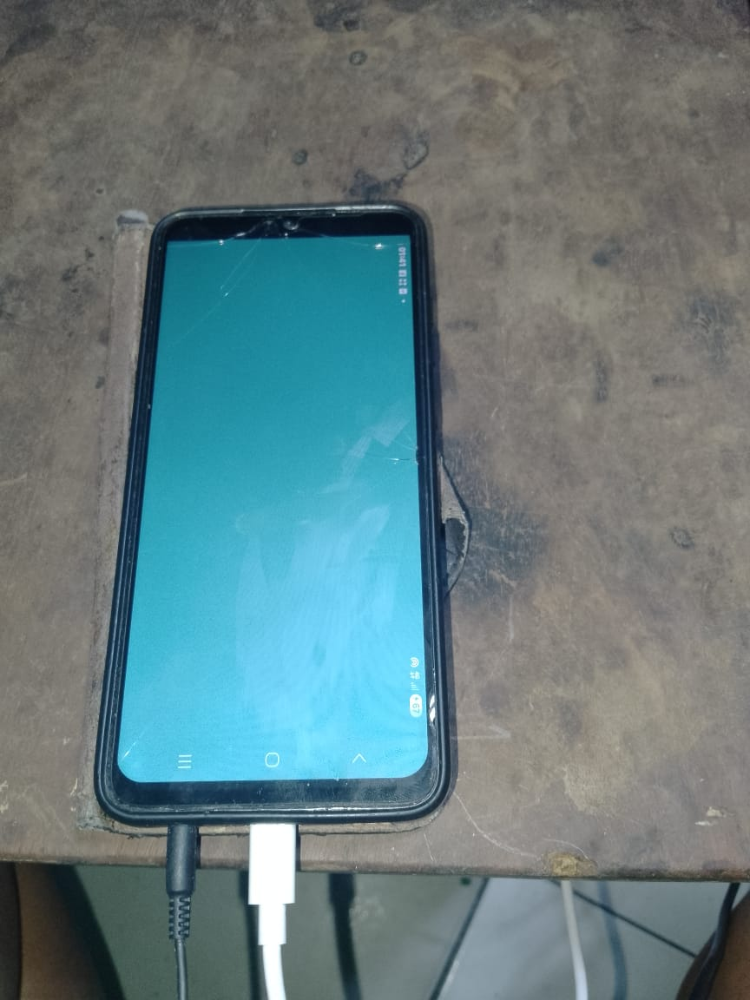

# Chapitre 02 — Exo 26 : choisir, et se tromper exprès

## Les appareils branchés

```text
C:\Android\platform-tools\adb.exe devices
List of devices attached
105453739L108475        device
R92X51YQD1P     device
```

| Série | Appareil (exercice 25) |
|---|---|
| `105453739L108475` | TECNO SPARK 10C (`TECNO KI5k`), Android 12, arm64-v8a |
| `R92X51YQD1P` | Samsung `SM-A055F`, Android 15, arm64-v8a |

Le paquet installé est l'APK signé de l'exercice 23 (`dist\MaSalle.apk`, arm64, 16 801 octets), qui affiche l'écran bleu-vert. Avant les essais, je l'ai désinstallé du TECNO (`adb -s 105453739L108475 uninstall com.mafo.masalle` → `Success`) pour partir d'un appareil sans l'application ; le Samsung ne l'avait pas encore (`Failure [DELETE_FAILED_INTERNAL_ERROR]`, le paquet n'existant pas).

J'utilise l'installation directe de `jenga deploy` : `--apk` donne le paquet à installer, `--run` lance l'application après l'installation, et `--target` donne le numéro de série de l'appareil, que Jenga transmet à `adb -s`.

## Le déploiement sans `--target`

```text
jenga deploy --platform android --apk ..\exo23-le_deploiement_automatise\dist\MaSalle.apk --run
```

Le message exact :

```text
adb.exe: more than one device/emulator
adb install failed.
```

La première ligne vient d'`adb` : deux appareils sont prêts, et rien ne lui dit lequel viser, alors il refuse plutôt que de choisir au hasard. La seconde vient de Jenga, qui constate l'échec. Sans `--target`, Jenga n'ajoute pas `-s` à la commande `adb` : c'est à moi de choisir. Rien n'a été installé nulle part.

## Les deux installations, à tour de rôle

Les deux commandes ne diffèrent que par le numéro de série :

```text
jenga deploy --platform android --apk ..\exo23-le_deploiement_automatise\dist\MaSalle.apk --target 105453739L108475 --run
jenga deploy --platform android --apk ..\exo23-le_deploiement_automatise\dist\MaSalle.apk --target R92X51YQD1P --run
```

### Sur le TECNO (`105453739L108475`)

J'ai d'abord désinstallé l'application du Samsung (`adb -s R92X51YQD1P uninstall com.mafo.masalle` → `Success`), puis installé sur le TECNO seul :

```text
Performing Incremental Install
Performing Streamed Install
Success
APK installed: ...\exo23-le_deploiement_automatise\dist\MaSalle.apk
Launching com.mafo.masalle...
App launched: com.mafo.masalle
```


À gauche, le TECNO (reconnaissable à sa vitre fissurée) affiche l'écran bleu-vert de MaSalle. À droite, le Samsung est resté sur son écran d'applications : l'installation est arrivée sur le TECNO, et seulement sur lui.

### Sur le Samsung (`R92X51YQD1P`)

```text
Performing Incremental Install
Performing Streamed Install
Success
APK installed: ...\exo23-le_deploiement_automatise\dist\MaSalle.apk
Launching com.mafo.masalle...
App launched: com.mafo.masalle
```



Le Samsung, dans son étui, affiche à son tour l'écran bleu-vert. La barre d'état est sur le côté droit, tournée : comme sur le TECNO, l'application s'ouvre en paysage (`androidscreenorientation("landscape")`).

### Vérification par la commande

Sur chaque appareil, en le désignant par son numéro de série :

```text
C:\Android\platform-tools\adb.exe -s 105453739L108475 shell pm list packages com.mafo.masalle
package:com.mafo.masalle

C:\Android\platform-tools\adb.exe -s R92X51YQD1P shell pm list packages com.mafo.masalle
package:com.mafo.masalle
```

## Ce qui n'a pas marché du premier coup

- **Un lancement annoncé comme raté.** Au premier essai sur le TECNO, Jenga a affiché `Launch failed for com.mafo.masalle.` après `Success`, alors que l'application était bien à l'écran. Au second essai, identique, il a affiché `App launched`. Sur le Samsung, le lancement a toujours été annoncé comme réussi. Jenga lance l'application avec `adb shell monkey` et considère tout code de retour non nul comme un échec ; sur le TECNO, `monkey` signale à chaque lancement les nombreux rapports de plantage que ce téléphone conserve, ce qui peut expliquer ce code d'erreur, mais je ne l'ai pas démontré. Ce que je retiens : le message de lancement ne prouve rien dans un sens ou dans l'autre, l'écran et `pm list packages` si.
- **Deux commandes collées sur une ligne.** En collant `uninstall` et `input keyevent` ensemble, `adb` a reçu un nom de paquet déformé et répondu `java.lang.IllegalStateException: Must specify package name to remove a split`. Rien de grave, mais c'est le même piège que dans les exercices précédents : une commande à la fois.

## Ce que j'en retiens

Dès que deux appareils sont branchés, **ne pas choisir est une erreur**, et l'outil a raison de refuser. Le numéro de série est le seul moyen de désigner un appareil : c'est `--list-devices --detailed` (exercice 25) qui dit quel numéro correspond à quel téléphone, et `--target` qui l'utilise. Mon script de déploiement de l'exercice 23 fait le même choix qu'`adb` : avec plusieurs appareils, il s'arrête et demande d'en garder un seul.
