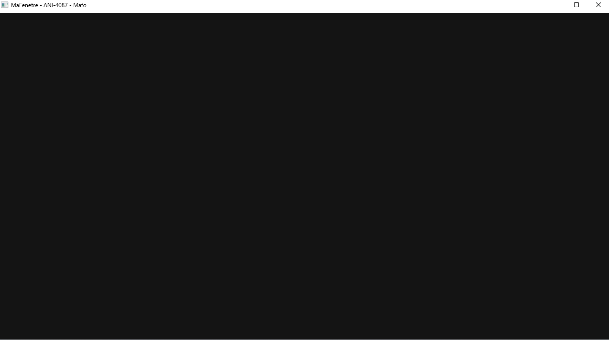

# Chapitre 03 — Exercice 1 : la fenêtre nue

## Ce qui est demandé

Écrire le programme de quinze lignes du chapitre, le construire avec Jenga, le lancer.
Rendre le fichier `.jenga`, une capture de la fenêtre, et le temps que cela a pris.

## Le montage

Le workspace est **autonome** : il vit dans ce dossier, hors du dépôt du moteur. Il ne
compile pas Nkentseu, il en consomme un **kit** — les bibliothèques déjà construites et
leurs en-têtes, produits par `jenga kit` et rangés dans `C:\Nkentseu`, en dehors du dépôt
comme la règle du cours l'exige.

```python
from Jenga import *

KIT = "C:/Nkentseu/NkentseuKit.jenga"

with workspace("MaFenetreWks"):
    configurations(["Debug", "Release"])
    useconfig(KIT)              # en-tetes, dossiers de bibliotheques, ordre de lien

    with project("MaFenetre"):
        windowedapp()           # application a fenetre : pas de console derriere
        language("C++")
        cppdialect("C++17")
        files(["src/main.cpp"])
        usenkentseukit()        # fonction ecrite par `jenga kit`
```

Le chemin du kit est isolé dans la constante `KIT`, en tête : une seule ligne à changer si
le kit est déplacé ou refait. `useconfig` est au niveau du **workspace**, parce que c'est
lui qui propage les symboles du kit à tous les projets ; `usenkentseukit()` est au niveau
du **projet**, parce que c'est lui qui ajoute les includes et l'ordre de lien à cette cible
précise. Les deux ne sont pas interchangeables.

Le kit contient 11 modules et 300 en-têtes pour 16,3 Mo, dans cet ordre de lien :

```text
NKWindow NKEvent NKFileSystem NKTime NKLogger NKMath NKThreading NKContainers NKMemory NKCore NKPlatform
```

## Le programme

```cpp
int nkmain(const NkEntryState &state) {
    NkWindowConfig cfg;                       // la configuration est une structure
    cfg.title = "MaFenetre - ANI-4087 - Mafo";
    cfg.width = 1280;
    cfg.height = 720;
    cfg.centered = true;

    NkWindow fenetre(cfg);                    // le constructeur ne leve pas d'exception
    if (!fenetre.IsValid())                   // c'est IsValid() qui dit si ca a marche
        return 1;

    bool tourne = true;
    NkEventSystem &evenements = NkEvents();
    evenements.AddEventCallback<NkWindowCloseEvent>([&](NkWindowCloseEvent *) { tourne = false; });

    while (tourne && fenetre.IsOpen()) {
        evenements.PollEvents();              // sans ca, le systeme croit l'application figee
        NkClock::Sleep((int64)10);            // pas de rendu : on rend la main au processeur
    }

    fenetre.Close();
    return 0;
}
```

Quatre choses que ce programme m'a apprises, et qu'on ne devine pas :

1. **Le point d'entrée n'est pas `main`.** C'est `nkmain(const NkEntryState&)`, déclaré
   par `NKWindow/NKMain.h`. Le vrai `main` est fourni par le moteur, différent sur chaque
   plateforme (Win32, Cocoa, Android, Emscripten…), et c'est lui qui construit l'état
   d'entrée avant d'appeler le mien et le détruit après.
2. **La configuration est une structure, pas des arguments.** On remplit `NkWindowConfig`
   champ par champ, puis on la passe au constructeur.
3. **Le constructeur ne lève pas d'exception** — cohérent avec un moteur zero-STL. C'est
   `IsValid()` qui dit si la fenêtre existe. Sans ce test, une fenêtre absente donnerait
   une boucle qui tourne sur du vide.
4. **Sans `PollEvents()`, le système croit l'application figée.** Ce n'est pas seulement
   « les événements n'arrivent pas » : Windows grise la fenêtre et propose de la fermer de
   force. Et le `Sleep(10)` existe parce que ce programme ne dessine rien : sans lui, la
   boucle mangerait un cœur entier pour ne rien faire.

## La fenêtre



Le titre de la barre est bien celui du code, la fenêtre est centrée, elle se ferme au clic
sur la croix — c'est le rappel `NkWindowCloseEvent` qui met `tourne` à `false`, pas le
système : le programme décide lui-même de s'arrêter.

L'intérieur est noir et le restera : **rien ne dessine**. Aucun rendu n'est branché dans ce
chapitre, donc la surface n'est jamais peinte. C'est ce que « nue » veut dire.

> **Un écart à vérifier :** l'image mesure 1273 × 712 pixels, alors que la configuration
> demande 1280 × 720. La différence peut venir du cadre exclu par l'outil de capture ou de
> la mise à l'échelle de l'affichage Windows. Rien ne prouve, à partir de cette capture
> seule, que la zone utile fait exactement la taille demandée — il faudrait faire dire à la
> fenêtre sa taille réelle, comme le fait `Tuto01Fenetre` avec son événement de
> redimensionnement.

## Le temps que ça a pris

**Environ 40 minutes**, dont **5 pour l'exercice lui-même**. Tout le reste est du montage :
installer de quoi pouvoir écrire ces quinze lignes.

| # | Étape | Repère |
|---:|---|---|
| 1 | Mettre Jenga à jour en 2.8.4, exigé par le moteur | ≈ 2 min |
| 2 | Cloner le moteur en version allégée (`--depth 1 --filter=blob:none --sparse`), 265 Mo | ≈ 5 min |
| 3 | Corriger le sparse-checkout, module `jengaconfig` manquant (`.jenga-typings`) | ≈ 2 min |
| 4 | Récupérer trois sous-modules : NKGlad, NKGLSlang, NKSPIRVCross | ≈ 3 min |
| 5 | Ajouter les dossiers réclamés par le workspace : Engine, Integrations, Sandbox, Tutoriels3D, puis Tools | ≈ 4 min |
| 6 | `jenga info` passe enfin, le moteur se charge | — |
| 7 | Première construction : échec, `Command not found: clang++` | — |
| 8 | Installer clang et lld dans MSYS2, avec une coupure et une reprise | ≈ 15 min |
| 9 | Construire `Tuto01Fenetre` : 25 projets, dont NKWindow en 21ᵉ | 1 min 53 |
| 10 | Vérifier que la fenêtre du tutoriel s'ouvre | ≈ 2 min |
| 11 | Fabriquer le kit : 11 modules, 300 en-têtes, 16,3 Mo | ≈ 1 min |
| 12 | Écrire `MaFenetre.jenga` et `src/main.cpp`, construire, lancer | ≈ 5 min |

Les étapes 6 et 7 n'ont pas de repère : elles ont été immédiates, et l'échec de la 7 n'a
coûté que le temps de lire le message.

**Les cinq obstacles réels :** la version de Jenga, le sparse-checkout incomplet — trois
fois de suite —, les sous-modules absents, l'absence de clang, et la coupure du
téléchargement de pacman. Aucun n'est un problème de programmation. Tous sont des problèmes
d'**installation**, et c'est la leçon que je garde de cet exercice.

## Ce que je retiens pour la suite

- **Le rapport est de 1 à 8.** Cinq minutes d'exercice, trente-cinq de montage. La prochaine
  fenêtre coûtera cinq minutes, parce que le montage est fait une fois pour toutes : c'est
  ce que ce chiffre me servira à mesurer.
- **Un dépôt allégé se paie en allers-retours.** Le clone partiel a économisé environ 1,8 Go,
  mais il a fallu quatre corrections successives avant que `jenga info` accepte de charger
  le workspace. Jenga s'arrête à la **première** ligne fautive et la donne avec son numéro ;
  il ne peut pas annoncer la suivante. Quatre erreurs, quatre lancements.
- **Le kit change la nature du projet.** Le dépôt du moteur charge près de 300 projets et
  met presque deux minutes à construire un tutoriel d'un seul fichier. Ici, le workspace
  n'en connaît qu'un. C'est la différence entre travailler *dans* le moteur et travailler
  *avec* lui.

## Limites de ce rendu

- **Une seule plateforme.** Windows x86_64, chaîne `clang-mingw`. Rien n'a été construit
  pour Android, Linux ni Web, alors que le kit et le moteur le permettent.
- **Une seule configuration.** Debug. Le workspace déclare Release, jamais construit ici.
- **Pas de mesure.** Ce chapitre n'ouvre qu'une fenêtre ; aucune durée d'image, aucun budget,
  rien à comparer avec le chapitre 2.
- **La taille réelle de la zone utile n'est pas vérifiée**, pour la raison dite plus haut.
- **Les temps sont des estimations**, relevés à la montre pendant le travail, pas chronométrés.

## Les fichiers de ce dossier

- `c4-exo1_reponse.md` : ce compte rendu ;
- `MaFenetre.jenga` : le workspace, rendu tel qu'il a construit ;
- `src/main.cpp` : les quinze lignes ;
- `capture-fenetre.png` : la fenêtre ouverte à l'écran ;
- `.gitignore` : `Build/`, `logs/`, les binaires et **`NkentseuKit/`** restent hors du dépôt —
  le kit vit dans `C:\Nkentseu`, jamais ici.
