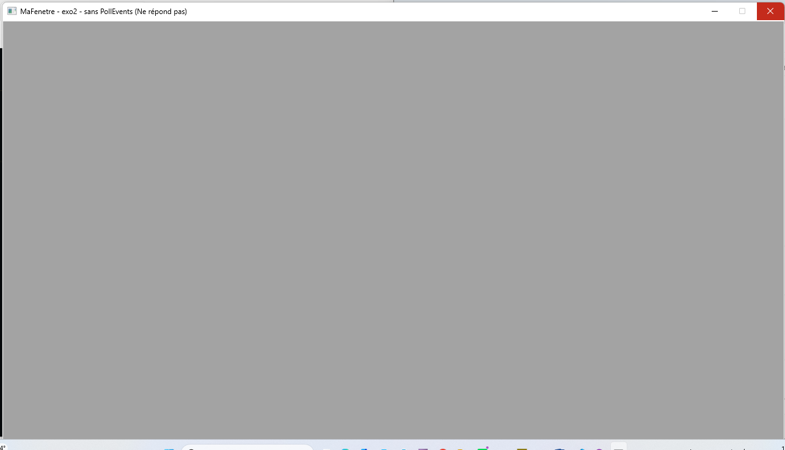
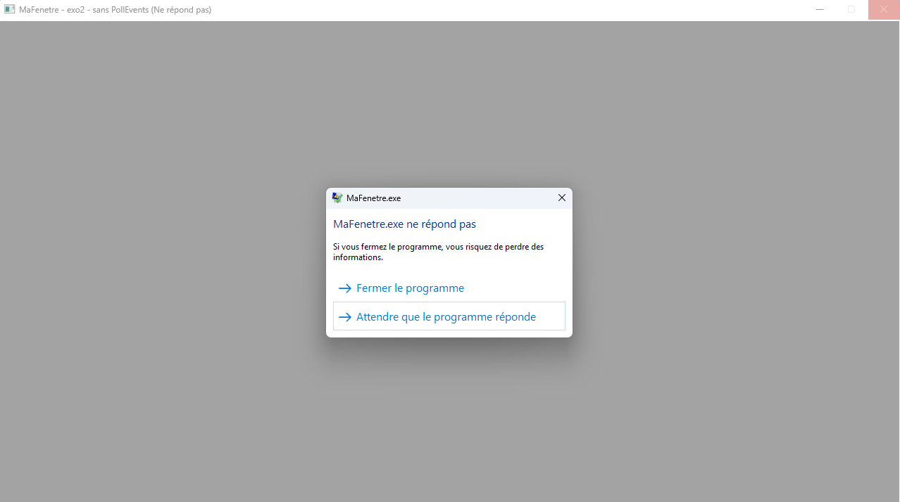

# Chapitre 03 — Exercice 2 : la fenêtre qui ne répond pas

## Ce qui est demandé

Remplacer le corps de la boucle par un commentaire, de façon à ne plus appeler
`PollEvents`. Lancer, attendre, capturer le moment où le système déclare la fenêtre
bloquée, et chronométrer au bout de combien de secondes cela arrive.

## La seule chose qui change

Le programme est celui de l'exercice 1. Une seule modification, et elle tient dans la
boucle :

```cpp
    while (tourne && fenetre.IsOpen()) {
        // evenements.PollEvents();          <-- RETIRE : c'est tout l'exercice.
        // NkClock::Sleep((int64)10);        <-- retire aussi : le corps est vide.
    }
```

Deux ajouts, qui ne changent rien à ce qui est démontré : le titre devient
`MaFenetre - exo2 - sans PollEvents`, pour qu'on ne confonde pas les captures des deux
exercices ; et une ligne de journal est placée **avant** la boucle, pour horodater le
départ à la milliseconde.

```cpp
    logger.Info("[exo2] T0 : entree dans la boucle SANS PollEvents.");
```

C'est la seule mesure fiable dont je dispose : dans la boucle, plus rien ne peut écrire,
puisque plus rien ne s'exécute que le test de la condition.

## La construction

```text
jenga build --config Debug

Configuration: Debug
Target:        Windows x86_64
Toolchain:     clang-mingw

Build Order (1 projects):
  1. MaFenetre [WINDOWED_APP]

ℹ Found 1 source file(s)
✓   [1/1] Compiled: main.cpp
ℹ Linking...
✓ Built: Build\Bin\Debug-Windows\MaFenetre\MaFenetre.exe

Projects Built:  1/1
Time:           1.95s
Status:         ✓ SUCCESS
```

Rien à signaler : le compilateur ne voit qu'un commentaire de plus. **Une boucle vide
compile aussi bien qu'une boucle juste** — c'est déjà une leçon. Aucun avertissement,
aucune erreur ; rien dans la construction n'annonce ce qui va se passer à l'exécution.

## Le lancement

```text
jenga run MaFenetre --config Debug

[NKLogger] niveau=info | console=debug | journal=...\exo2-la_fenetre_qui_ne_repond_pas\logs\app.log
[2026-09-27 19:05:32.432] [INF] [default] [main.cpp:36 in nkmain] -> [exo2] T0 : entree dans la boucle SANS PollEvents.

  ◀  FIN D'EXECUTION  —  termine avec le code 3489660927  (459.46s)
```

Une seule ligne de journal, à 19:05:32,432. C'est la dernière que le programme écrira : la
ligne `[exo2] Termine.`, placée après la boucle, n'apparaît jamais, parce qu'on ne sort
jamais de la boucle. L'événement de fermeture ne peut pas arriver — personne ne le dépile —
donc `tourne` reste vrai pour toujours.

## Ce que le système affiche

**1. La barre de titre gagne une mention, et la fenêtre grise.**



Le titre devient `MaFenetre - exo2 - sans PollEvents (Ne répond pas)`. Ce n'est pas le
programme qui l'écrit : c'est Windows qui ajoute la mention à la barre de titre d'une
fenêtre dont il n'obtient plus de réponse. La surface, noire à l'exercice 1, est devenue
grise et uniforme : l'application ne pouvant plus repeindre, le système affiche une
substitution à sa place.

**2. Le clic sur la croix ouvre la boîte de dialogue du système.**



> MaFenetre.exe ne répond pas. Si vous fermez le programme, vous risquez de perdre des
> informations. → Fermer le programme → Attendre que le programme réponde

Ce dialogue n'appartient pas à l'application : il appartient à Windows, qui l'interpose
parce que la fenêtre ne traite pas la demande de fermeture. Les deux choix proposés
résument la situation : tuer le processus, ou espérer qu'il revienne — ce qui n'arrivera
jamais ici, la boucle n'ayant aucune issue.

## Le chronomètre

Plutôt que de compter à la main, j'ai fait mesurer la machine. Le script
`mesure-blocage.ps1` lance le programme, attend l'apparition de la fenêtre — c'est T0 —,
puis interroge le processus jusqu'à ce que Windows le déclare non réactif. Il interroge
avec le même mécanisme que le système lui-même : un message envoyé à la fenêtre, et
l'attente d'une réponse qui ne vient pas.

```text
powershell -ExecutionPolicy Bypass -File mesure-blocage.ps1

Processus lance (PID 8064), attente de la fenetre...
T0 - fenetre ouverte a 19:25:38.949

DELAI : declaree bloquee apres 5,02 secondes
PROCESSEUR : 8,02 s de calcul en 8,02 s de temps reel
             soit environ 100 % d'un coeur (12 coeurs sur cette machine)
```

**Délai mesuré : 5,02 secondes**, entre l'ouverture de la fenêtre et le moment où Windows
la déclare bloquée.

Trois précisions sur ce chiffre :

- **Le blocage n'est pas détecté tout seul.** Tant que personne ne sollicite la fenêtre —
  un clic, un déplacement, une demande de fermeture, ou le message que le script envoie —,
  le système n'a aucune raison de la déclarer bloquée. Ce qui est mesuré est le temps
  entre la sollicitation et le verdict, pas une horloge qui tournerait depuis le
  lancement.
- **La mesure ne peut pas être plus fine que l'attente.** L'interrogation accorde environ
  cinq secondes à la fenêtre pour répondre avant de conclure. Les 5,02 s sont donc ce
  délai d'attente arrivé à son terme, et non une valeur que la machine aurait calculée.
  C'est aussi le seuil de Windows : une fenêtre qui ne dépile plus ses messages pendant
  cinq secondes est réputée bloquée.
- **Les 459,46 s du premier lancement ne sont pas le délai demandé.** Ces sept minutes et
  demie incluent l'attente, les deux captures et la fermeture forcée.

## Ce que coûte une boucle vide

```text
PROCESSEUR : 8,02 s de calcul en 8,02 s de temps reel
             soit environ 100 % d'un coeur (12 coeurs sur cette machine)
```

Huit secondes de calcul en huit secondes de temps réel : la boucle occupe **exactement un
cœur, en permanence**, pour ne rien produire. Le processeur tourne à plein régime sur le
seul test `tourne && fenetre.IsOpen()`.

Et voici le piège : sur une machine à douze cœurs, cela ne représente que **8 % du
processeur total**. Dans le Gestionnaire des tâches, `MaFenetre.exe` afficherait un
pourcentage modeste, d'apparence inoffensive. Le rapport au *cœur* est le bon chiffre ;
le rapport à la *machine* dissimule le problème.

Le `NkClock::Sleep((int64)10)` de l'exercice 1 n'était donc pas une politesse : il rendait
la main entre deux tours. Le retirer, à soi seul, suffit à consommer un cœur.

## La fin du processus

```text
◀  FIN D'EXECUTION  —  termine avec le code 3489660927  (459.46s)
```

3 489 660 927 vaut **0xCFFFFFFF** en hexadécimal. Ce n'est ni 0, ni un code que le
programme aurait choisi : `return 0` n'a jamais été atteint. Le code vient de la
terminaison forcée par le système, à la suite du « Fermer le programme ». Je ne cherche pas
à en décoder la signification exacte ; ce qui compte ici est qu'il soit **non nul**, et
qu'il dise à quiconque relit la trace que ce programme ne s'est pas terminé, il a été
arrêté.

## Ce que l'exercice montre

1. **`PollEvents` n'est pas une formalité, c'est le contrat.** Une application à fenêtre
   promet au système de lire ses messages. Elle ne les lit plus : le système la déclare
   défaillante et propose à l'utilisateur de la tuer. Une ligne retirée suffit.
2. **La construction ne prévient de rien.** Aucun avertissement du compilateur, aucune
   remarque de Jenga : la panne est entièrement à l'exécution. C'est la même leçon qu'au
   chapitre 2, transposée d'un fichier `.jenga` à du C++ — seul le résultat parle.
3. **Une boucle vide n'est pas un programme qui ne fait rien.** Mesuré : 100 % d'un cœur,
   en continu, pour tourner sur le test de la condition. Le `Sleep(10)` de l'exercice 1
   n'était pas une politesse.
4. **Ce que montre l'écran n'est pas ce que fait le programme.** La mention « (Ne répond
   pas) », le gris, la boîte de dialogue : rien de tout cela ne vient de l'application. Ce
   sont des ajouts du système autour d'un processus qui, lui, tourne à pleine vitesse et se
   croit parfaitement sain.

## Limites de ce rendu

- **Une seule machine, un seul système.** Le seuil de détection est propre à Windows ; un
  environnement de bureau Linux réagirait autrement, avec un autre délai et d'autres mots.
- **La consommation processeur est mesurée sur huit secondes seulement**, par le temps
  processeur cumulé du processus, pas par le Gestionnaire des tâches. Sur une durée plus
  longue, la limitation thermique de la machine pourrait faire baisser ce chiffre.
- **Le délai de 5,02 s est le résultat d'une seule exécution** et vaut pour cette machine,
  peu chargée. Il n'a pas été reproduit.
- **Le code 0xCFFFFFFF n'est pas expliqué**, seulement constaté et signalé comme non nul.

## Les fichiers de ce dossier

- `c4-exo2_reponse.md` : ce compte rendu ;
- `MaFenetre.jenga` : le workspace, inchangé depuis l'exercice 1 ;
- `src/main.cpp` : le programme, corps de boucle commenté ;
- `mesure-blocage.ps1` : le script de mesure du délai et de la charge processeur ;
- `capture-ne-repond-pas.png` : la barre de titre et la fenêtre grisée ;
- `capture-dialogue-systeme.png` : la boîte de dialogue de Windows ;
- `.gitignore` : `Build/`, `logs/`, les binaires et `NkentseuKit/` restent hors du dépôt.
