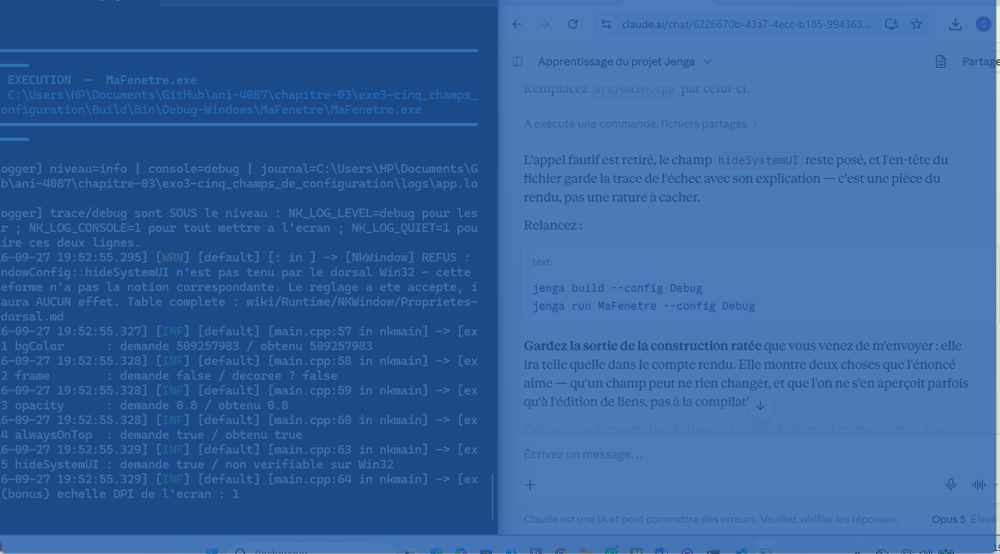

# Chapitre 03 — Exercice 3 : cinq champs de configuration

## Ce qui est demandé

Modifier cinq champs de `NkWindowConfig` que le chapitre n'a pas montrés, choisis dans
`NkWindowConfig.h`. Pour chacun : la ligne, ce que j'attendais, ce que j'ai observé. Un
champ sans effet est une réponse valable, à condition de dire pourquoi.

## Les cinq champs, et comment je les ai vérifiés

Le chapitre avait montré `title`, `width`, `height` et `centered`. J'ai pris cinq autres
champs, dans trois sections différentes du fichier : apparence, fenêtre discrète, et
« Android specifics ».

```cpp
cfg.bgColor = 0x1E5AA8FF;   // 1. couleur de fond          (defaut 0x141414FF)
cfg.frame = false;          // 2. cadre et barre de titre  (defaut true)
cfg.opacity = 0.80f;        // 3. opacite globale [0..1]   (defaut 1.0)
cfg.alwaysOnTop = true;     // 4. au-dessus des autres     (defaut false)
cfg.hideSystemUI = true;    // 5. barres systeme — ANDROID (defaut false)
```

**Poser un champ ne prouve rien.** `NkWindowConfig.h` prévient en tête de structure :
« un accesseur décrit le monde, pas notre mémoire ». Le programme demande donc à la
fenêtre, après création, ce qu'elle **est** — `GetBackgroundColor()`, `IsDecorated()`,
`GetOpacity()`, `IsAlwaysOnTop()` — et journalise les deux valeurs côte à côte. C'est la
différence entre « j'ai écrit la ligne » et « la ligne a été tenue ».

## Le journal

```text
[2026-09-27 19:52:55.295] [WRN] [NkWindow] REFUS : NkWindowConfig::hideSystemUI n'est pas
    tenu par le dorsal Win32 - cette plateforme n'a pas la notion correspondante. Le
    reglage a ete accepte, il n'aura AUCUN effet.
    Table complete : wiki/Runtime/NKWindow/Proprietes-dorsal.md
[2026-09-27 19:52:55.327] [INF] [exo3] 1 bgColor      : demande 509257983 / obtenu 509257983
[2026-09-27 19:52:55.328] [INF] [exo3] 2 frame        : demande false / decoree ? false
[2026-09-27 19:52:55.328] [INF] [exo3] 3 opacity      : demande 0.8 / obtenu 0.8
[2026-09-27 19:52:55.329] [INF] [exo3] 4 alwaysOnTop  : demande true / obtenu true
[2026-09-27 19:52:55.329] [INF] [exo3] 5 hideSystemUI : demande true / non verifiable sur Win32
[2026-09-27 19:52:55.329] [INF] [exo3] (bonus) echelle DPI de l'ecran : 1
```



## Champ par champ

| # | La ligne | Ce que j'attendais | Ce que j'ai observé |
|---|---|---|---|
| 1 | `cfg.bgColor = 0x1E5AA8FF;` | La surface vide passe du noir au bleu | Tenu. `obtenu 509257983`, soit exactement `0x1E5AA8FF`. Toute la fenêtre est bleue |
| 2 | `cfg.frame = false;` | Plus de barre de titre, plus de croix, plus de bordure | Tenu. `IsDecorated()` rend `false`. Aucun cadre à l'écran |
| 3 | `cfg.opacity = 0.80f;` | La fenêtre laisse voir ce qu'il y a dessous | Tenu. `GetOpacity()` rend `0.8`. Le terminal et le navigateur se lisent au travers |
| 4 | `cfg.alwaysOnTop = true;` | Elle reste devant les autres fenêtres | Tenu. `IsAlwaysOnTop()` rend `true`. Elle couvre tout, y compris la fenêtre active |
| 5 | `cfg.hideSystemUI = true;` | **Aucun effet** : champ rangé sous « Android specifics », et je suis sur Windows | Aucun effet, **et le moteur le dit lui-même** dans un avertissement nommé, avant même mes lignes |

### 1. `bgColor` — la réponse à une question de l'exercice 1

La valeur par défaut est `0x141414FF`. C'est elle qui explique le noir de la fenêtre nue
de l'exercice 1 : je croyais voir « rien », je voyais en fait une couleur, choisie par
défaut et peinte par le système. Avec `0x1E5AA8FF`, la même fenêtre vide est bleue. Rien
n'a été dessiné pour autant — c'est toujours une fenêtre sans rendu.

L'accesseur rend le nombre exact demandé, 509 257 983. La couleur est donc conservée
telle quelle, sans conversion ni perte.

### 2. `frame` — le champ qui coûte l'accès à sa propre fenêtre

Sans cadre, plus de croix : l'utilisateur n'a plus aucun moyen de fermer la fenêtre à la
souris. J'ai dû ajouter une sortie au clavier **avant** de lancer le programme :

```cpp
evenements.AddEventCallback<NkKeyPressEvent>([&](NkKeyPressEvent *e) {
    if (e->GetKey() == NkKey::NK_ESCAPE)
        tourne = false;     // indispensable : sans cadre, pas de croix
});
```

C'est la leçon cachée de ce champ : il ne change pas seulement l'apparence, il retire une
fonction, et c'est au programme de la remplacer.

### 3. `opacity` — visible seulement en contexte

L'opacité ne se voit pas sur une capture de la fenêtre seule : il faut quelque chose
derrière. Sur la capture, le terminal et le navigateur se lisent à travers le bleu. Le
fichier note que ce réglage existe aussi à l'exécution, via `SetOpacity`, mais que le
poser à la création évite le clignotement d'une fenêtre créée normale puis corrigée une
image plus tard.

### 4. `alwaysOnTop` — et un effet de bord que je n'avais pas prévu

La fenêtre reste devant tout le reste. Combinée aux trois champs précédents — sans cadre,
translucide, bleue, 1280 × 720 au centre — elle recouvre l'écran d'un voile bleu qu'on ne
peut ni déplacer ni fermer à la souris. La capture le montre bien : on voit la
conversation et le terminal **à travers** la fenêtre, pas à côté.

Quatre champs anodins pris un à un ; ensemble, une fenêtre dont on ne se débarrasse qu'au
clavier.

### 5. `hideSystemUI` — sans effet, et deux fois plutôt qu'une

Ce champ est rangé dans `NkWindowConfig.h` sous `// --- Android specifics ---`, avec le
commentaire « Masquer status bar + navigation bar ». Sur un bureau Windows, il n'y a ni
l'une ni l'autre : je n'attendais aucun effet. Deux choses l'ont confirmé, et la première
m'a arrêtée net.

**a) L'édition de liens a refusé ma première version.** Elle appelait
`fenetre.GetHideSystemUI()` pour vérifier le champ comme les quatre autres :

```text
ℹ Found 1 source file(s)
✓   [1/1] Compiled: main.cpp
ℹ Linking...
  C:/msys64/ucrt64/bin/ld: ...src_main.obj: in function `nkmain(...)':
  main.cpp:50: undefined reference to `nkentseu::NkWindow::GetHideSystemUI() const'
  clang++: error: linker command failed with exit code 1
✗ Link failed
```

**La compilation passe, l'édition de liens échoue** — exactement l'étape de la chaîne que
le chapitre 2 apprenait à reconnaître. L'accesseur est **déclaré** dans `NkWindow.h` pour
toutes les plateformes, mais il n'est **défini** que dans les dorsaux Noop, XLib, XCB,
Wayland, Emscripten, HarmonyOS et Android. `NkWin32Window.cpp` ne le contient pas. Sur
Windows, le symbole n'existe pas. J'ai retiré l'appel et gardé le champ.

**b) Le moteur refuse le réglage à voix haute.** Avant même mes cinq lignes de journal :

> REFUS : `NkWindowConfig::hideSystemUI` n'est pas tenu par le dorsal Win32 — cette
> plateforme n'a pas la notion correspondante. Le réglage a été accepté, il n'aura AUCUN
> effet.

Ce n'est pas un hasard : le wiki du module porte la doctrine, et l'incident qui l'a
provoquée. « Une propriété qui s'accepte sans agir est pire qu'une propriété absente :
l'absence se voit à la compilation, le silence se paie en heures perdues. » La table
`Proprietes-par-dorsal.md` classe `hideSystemUI` sur bureau comme un **refus nommé**,
« sans objet sur un bureau », par opposition au silence.

> **Petit défaut relevé au passage :** l'avertissement renvoie à
> `wiki/Runtime/NKWindow/Proprietes-dorsal.md`, mais le fichier du dépôt s'appelle
> `Proprietes-par-dorsal.md`. Le chemin cité ne mène nulle part.

## Le bonus : l'échelle DPI vaut 1

```text
[exo3] (bonus) echelle DPI de l'ecran : 1
```

Cette ligne clôt une question laissée ouverte à l'exercice 1, où la capture mesurait
1273 × 712 pixels pour une fenêtre demandée à 1280 × 720. L'échelle d'affichage vaut 1 :
la mise à l'échelle de Windows n'y est pour rien. L'écart vient de l'outil de capture,
pas du moteur.

## Ce que l'exercice montre

1. **Un champ posé n'est pas un champ tenu.** Quatre l'ont été, un non. Sans les
   accesseurs, les cinq lignes auraient eu exactement la même allure dans le code source.
2. **Les trois manières dont un réglage peut échouer ne se ressemblent pas.** Le silence
   — le pire, invisible ; le refus nommé — ce que fait Nkentseu ici, lisible dans le
   journal ; et l'absence pure et simple du symbole — celle-là, l'édition de liens la
   crie. J'ai rencontré les deux dernières dans le même exercice.
3. **Le défaut est une valeur, pas un vide.** `bgColor = 0x141414FF` peignait déjà ma
   fenêtre « nue » de l'exercice 1.
4. **Des champs anodins se combinent en piège.** Quatre réglages tenus, et une fenêtre
   qu'on ne peut plus ni déplacer, ni fermer à la souris, ni contourner.

## Limites de ce rendu

- **Une seule plateforme.** Tout ce qui est dit de Win32 ne vaut que pour Win32. La table
  du wiki indique que `alwaysOnTop` et `opacity` sont en **silence** sur plusieurs dorsaux
  mobiles : les mêmes cinq lignes donneraient un autre tableau sur Android.
- **Les champs ont été posés ensemble**, en une seule exécution. Chaque effet a été
  attribué d'après son accesseur, pas par cinq essais isolés.
- **`hideSystemUI` n'a pas été testé là où il a un sens.** Conclure qu'il fonctionne sur
  Android demanderait de construire pour Android, ce que cet exercice n'a pas fait.
- **La combinaison n'a pas été mesurée**, seulement observée : rien ici ne dit ce que
  coûte une fenêtre translucide en temps d'image.

## Les fichiers de ce dossier

- `c4-exo3_reponse.md` : ce compte rendu ;
- `MaFenetre.jenga` : le workspace, inchangé depuis l'exercice 1 ;
- `src/main.cpp` : les cinq champs et leur vérification par accesseurs ;
- `capture-cinq-champs.png` : la fenêtre sans cadre, bleue et translucide, au premier plan ;
- `.gitignore` : `Build/`, `logs/`, les binaires et `NkentseuKit/` restent hors du dépôt.
